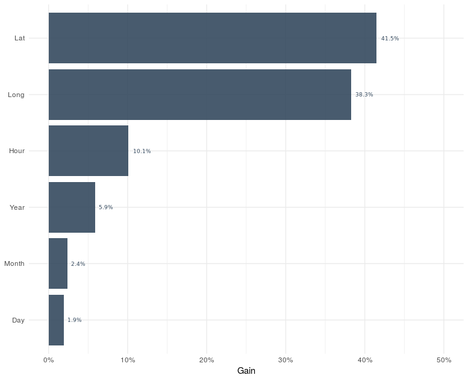
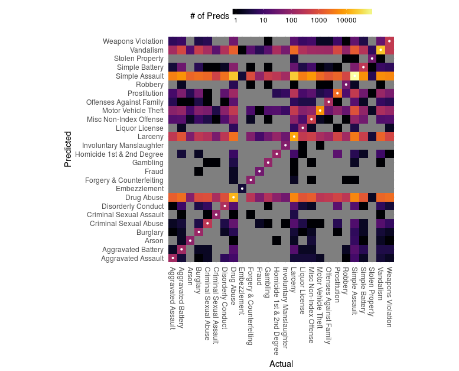

```{r setup, include=FALSE}
knitr::opts_chunk$set(echo = TRUE)
library(dplyr)
library(data.table)
library(caret)
library(ggplot2)

df_ <- fread('Predicting And Mapping Arrest Types/Crimes_-_2001_to_present.csv')
df_code_index <- fread('Predicting And Mapping Arrest Types/Code_Index_Type.csv')
df_index <- fread('Predicting And Mapping Arrest Types/Crimes 2001 to present(Index).csv')
df_results <- fread('Predicting And Mapping Arrest Types/df_results.csv')
df_imp <- fread('Predicting And Mapping Arrest Types/df_imp.csv')
```

Given the location and date/time, can we predict arrest type for the city of Chicago?

In this post we will use `xgboost` to predict arrest type, `leaflet` to map, and `shiny` to let the user input information to make a prediction. 

For the impatient here is the final product and a [link](https://rszumski.shinyapps.io/Arrest_Type_Prediction_Chicago/) to the full page shiny app.

```{r,echo=F}
htmltools::tags$iframe(src = 'https://rszumski.shinyapps.io/Arrest_Type_Prediction_Chicago/', width = '800', height = '600', style="border:none;")
```


Okay, let's give the `xgboost` R package a look and test it out on the [Crimes - 2001 to present](https://data.cityofchicago.org/Public-Safety/Crimes-2001-to-present/ijzp-q8t2) dataset from the [Chicago Data Portal](https://data.cityofchicago.org/). 

But first what is XGBoost? XGBoost is an optimized distributed gradient boosting library designed to be highly efficient, flexible and portable. It implements machine learning algorithms under the Gradient Boosting framework. XGBoost provides a parallel tree boosting that solve many data science problems in a fast and accurate way.

### The data

The dataset contains (at time of writing) about 6.5 million reports with 17 different variables. While not 'big data' it's still a little heavy for my laptop. Luckily for me Chicago Data Portal allows one to manage and filter the data before exporting it. So I selected the date of occurrence, FBI code, longitude, and latitude and filtered when an arrest was made. This left just under 1 million observations, much more manageable.

```{r, echo=FALSE}
str(df_ %>% select(-Arrest))
```

There are 26 different types of arrests in the FBI Code column, but I have no idea what those codes mean. So after a quick Google search I can across [CLEARMAP](http://gis.chicagopolice.org/clearmap_crime_sums/crime_types.html), a website of crime type categories, definition, and description, supplied by the Chicago Police Department.

After some work with `rvest` I got the code, it's description, and gave each code an index variable (saved as df_code_index).

```{r, echo=FALSE}
df_code_index
```

Next, we can engineer features from the data of occurrence column. We can extract the hour in which a given arrest occurred as a feature (hour can take 24 different values) , likewise, we can extract the month in a similar manner (12 values), the year the crime occurred can be extracted (2001 — present), and finally the DayOfWeek (7 values).

```{r, eval=F}
library(lubridate)

df_ <- df_ %>% 
  separate(Date, c('Date', 'time', 'AM.PM'), sep = ' ') %>%
  unite(Time, time, AM.PM, sep = ' ')

df_$Date <-as.Date(as.POSIXct(df_$Date, format= '%m/%d/%Y'))

df_$Time <- format(strptime(df_$Time, "%I:%M:%S %p"), format="%H")

df_ <- df_ %>%
  mutate(Month = month(Date),
         Day   = wday(Date),
         Year = year(Date))

df_ <- df_ %>%
  rename(Hour = Time,
         Lat = Latitude,
         Long = Longitude,
         Type = FBI.Code)

df_ <- df_ %>%
  select(Type, Hour, Day, Month, Year, Lat, Long)
```

Along with the latitude/longitude coordinates that gives us six features. 

XGBoost needs all the variables as a numeric vector so let's replace the FBI code with the index variable we assigned each code.

```{r, eval=F}
df_index <- left_join(df_, df_code_index)  %>% select(-Type)
```

```{r, echo=F}
head(df_index)
```

### The modeling

Before we start we should set a benchmark for ourselves. If our model is not more accurate than a benchmark, then our fancy modeling is all for naught. Let's look at the arrest type that happens most often

```{r}
df_index %>% group_by(Index) %>%
  summarize(Total = n()) %>%
  arrange(desc(Total))
```

In this case, a simple benchmark might be to just always predict the most common arrest type - Index 6 (Simple Assault). This is equivalent to calculating the percent of the data labeled 'Simple Assault'.

```{r}
round(347194/length(df_index$Index), 4)
```

Just guessing the most common type has an accuracy of about 35%. Let's see if we can do better than that.

We can use `caret` for train/test splitting since createDataPartition ensures balanced distribution of categories between train and test.

```{r, eval=F}
library(caret)
library(dplyr)
library(data.table)

## Loading the final dataset with the engineered features
df <- fread('Crimes 2001 to present(Index).csv')

split <- 0.7
trainIndex <- createDataPartition(df$Index, p = split, list = FALSE, times = 1)


xgb.data.train <- xgb.DMatrix((df %>% select(-Index) %>% data.matrix())[trainIndex,], 
                              label = df$Index[trainIndex])


xgb.data.test <- xgb.DMatrix((df %>% select(-Index) %>% data.matrix())[-trainIndex,],
                             label = df$Index[-trainIndex])

```

### The XGBoost training

```{r, eval=F}
library(xgboost)

numberOfClasses <- length(unique(df$Index))

xgb_params <- list("objective" = "multi:softprob",
                   "eval_metric" = "mlogloss",
                   "num_class" = numberOfClasses)

xgb <- xgb.train(data = xgb.data.train,
                params = xgb_params,
                nrounds = 500,
                watchlist = list(test = xgb.data.test),
                early_stopping_rounds = 10
)
## saving the model
xgb.save(xgb, 'xgb.model')
```

### Analyzing the XGBoost model

With gradient boosting we can calculate the proportional contribution of each feature to the total information gain of the model, which will help identify the most important features.

```{r, eval=F}
library(ggplot2)

df_imp <- tbl_df(xgb.importance(colnames(xgb.data.train), model = xgb))
df_imp$Feature <- factor(df_imp$Feature, levels=rev(df_imp$Feature))

ggplot(df_imp, aes(x=Feature, y=Gain)) +
  geom_bar(stat="identity", fill="#34495e", alpha=0.9) +
  geom_text(aes(label=sprintf("%0.1f%%", Gain*100)), color="#34495e", hjust=-0.25, family="Open Sans Condensed Bold", size=2.5) +
  theme_minimal() +
  coord_flip() +
  scale_y_continuous(limits = c(0, 0.5), labels = scales::percent) +
  theme(plot.title=element_text(hjust=0.5), axis.title.y=element_blank())
```



Unsurprisingly, location features are the most important, with both location-based features establishing almost 80% of the total Gain in the model. The Day feature adds less than 2% to the total gain, meaning it might be insignificant.

Let's calculate the accuracy of the model on the test set using `confusionMatrix()` from the `caret` package.

```{r, eval=F}
test <- (df %>% select(-Index) %>% data.matrix())[-trainIndex,]

preds_matrix <- predict(xgb, test, reshape=T)

results <- t(apply(preds_matrix, 1, function (x) {
  max_index = which(x==max(x))
  return (c(max_index-1, x[max_index]))
}))

df_results <- data.frame(results, label_act = df$Index[-trainIndex]) %>%
  tbl_df() %>%
  transmute(label_pred = X1, prod_pred = X2, label_act)
```
```{r}
cm <- confusionMatrix(df_results$label_pred, df_results$label_act)

data.frame(cm$overall)
```

We got an accuracy of about 49%, which is the proportion of predictions where the predicted category value matches the actual category value. That might seem low. However, if you predicted a 'Simple Assault' label for all the test-set values, you would get an accuracy of 35%. A 14% improvement isn't half bad and we beat our benchmark.

Accuracy is a fairly simple metric that will often not be able to capture the nuances of multi-class classification. Let’s take a look at the confusion matrix.

```{r, eval=F}
library(viridis)

df_cm <- df_cm %>%
  left_join(df_code_index, by = c("Prediction" = "Index")) %>%
  left_join(df_code_index, by = c("Reference" = "Index")) %>%
  rename(label_pred = Type.x, label_act = Type.y)

df_correct <- df_cm %>% filter(label_pred == label_act)

ggplot(df_cm, aes(x=label_act, y=label_pred, fill = Freq)) +
  geom_tile() +
  geom_point(data=df_correct, color="white", size=0.8) +
  theme_minimal() +
  coord_equal() +
  scale_x_discrete() +
  scale_y_discrete() +
  theme(legend.position="top", legend.direction="horizontal", legend.key.width=unit(1.25, "cm"), 
        legend.key.height=unit(0.25, "cm"),
        axis.text.x=element_text(angle=-90, size=9, vjust=0.5, hjust=0), axis.text.y=element_text(size=9), 
        plot.title = element_text(hjust=1)) +
  scale_fill_viridis(option="B",name="# of Preds", breaks=10^(0:4), trans="log10") +
  labs(x = "Actual",
       y = "Predicted")
```



There is a large amount of confusion. Many of the labels are mispredicted as Simple Assault. Specifically, the model frequently confuses the combinations of Assault, Drug Abuse, and Larceny, suggesting that they also may be catch-alls.

### Mapping the predicted types of arrest

Equally as important as model creating is implementing and executing the models. Since we can predict the type of crime based on the given location and date/time of an arrest, we can map boundaries of the mostly likely type of offense. 

We can head over to [BoundingBox](http://boundingbox.klokantech.com/) and get a bounding box (bbox) for Chicago. With that let's create 5625 latitude/longitude points to simulate locations.

```{r, eval=F}
bbox = c(-87.940102,41.643921,-87.523987,42.023022)

grid_size = 75
df_points <- data.frame(expand.grid(Long=seq(bbox[1], bbox[3], length.out=grid_size),
                                    Lat=seq(bbox[2], bbox[4], length.out=grid_size)))
write.csv(df_points,'df_points.csv', row.names = F)
```

Now we can use this newly created dataframe and the XGBoost model to predict the most-likely type of arrest at the location with a given date/time, create a raster imagine of the prediction types, and plot it using `leaflet`. 

To take it one step further we can make the prediction, create the raster, and plot it from user input using `shiny`. 

```{r, eval=F}
library(shiny)
library(leaflet)
library(raster)
library(dplyr)
library(lubridate)
library(xgboost)
library(rgdal)

df_points <- read.csv('df_points.csv')
bst <- xgb.load('xgb.model')
df_labels <- read.csv('df_labels.csv') %>% mutate_if(is.integer, as.character)
df_loc <- read.csv('community area.csv')

ui <- bootstrapPage(
  tags$style(type = 'text/css', 'html, body {width:100%;height:100%}'),
  verbatimTextOutput('date_time'),
  leafletOutput('map', width = '100%', height = '100%'),
  absolutePanel(top = 10, right = 250,
                dateInput('date',
                          label = 'Choose Date:',
                          value = Sys.Date()
                ),
                selectInput('hour', 'Choose Hour of the Day:', 
                            choices = c('1 a.m.' = 1, '2 a.m.' = 2, '3 a.m.' = 3,
                                        '4 a.m.' = 4, '5 a.m.' = 5, '6 a.m.' = 6,
                                        '7 a.m.' = 7, '8 a.m.' = 8, '9 a.m.' = 9,
                                        '10 a.m.' = 10, '11 a.m.' = 11, '12 noon' = 12,
                                        '1 p.m.' = 13, '2 p.m.' = 14, '3 p.m.' = 15,
                                        '4 p.m.' = 16, '5 p.m.' = 17, '6 p.m.' = 18,
                                        '7 p.m.' = 19, '8 p.m.' = 20, '9 p.m.' = 21,
                                        '10 p.m.' = 22, '11 p.m.' = 23, '12 midnight' = 24),
                            selected = 12
                ),
                actionButton('updateButton', 'Predict', class = 'btn-primary'),
                h2(),
                selectInput('loc', 'Zoom to Community Area:', 
                            df_loc$community_area)
  )
)


server <- function(input, output, session) {

   output$map <- renderLeaflet({
     leaflet() %>% addProviderTiles('OpenStreetMap.Mapnik') %>%
       setView(lng = -87.6298, lat = 41.8781, zoom = 11) %>%
       addMeasure(position = 'bottomleft') %>%
       addEasyButton(easyButton(
         icon = 'fa-home',
         title = 'Default View',
         onClick = JS('function(btn, map){ map.setView({lon: -87.6298, lat :41.8781}, 11); }')))
    })
   
   df_points_ <- eventReactive(input$updateButton,{
     df_points %>%
       mutate(Hour = input$hour,
              Month = month(input$date),
              Year = year(input$date),
              Day = wday(input$date)) %>%
       .[,c(3,6,4,5,2,1)] %>% 
       data.matrix()
   })

   
   preds_matrix_ <- eventReactive(input$updateButton,{
     matrix(predict(bst, df_points_()), byrow=T, nrow(df_points_()), 26)
   })
   
   results_ <- eventReactive(input$updateButton,{
     t(apply(preds_matrix_(), 1, function (x) {
     max_index = which(x==max(x))
     return (c(max_index-1, x[max_index]))
   }))
   })
   
   df2 <- eventReactive(input$updateButton,{
     data.frame(Long = df_points_()[,6], Lat = df_points_()[,5],
                label = factor(results_()[,1]), prob = results_()[,2]) %>%
       tbl_df() %>%
       mutate_if(is.factor, as.character) %>%
       left_join(df_labels, by = c('label' = 'Index')) %>%
       mutate(Type = factor(Type)) %>% 
       left_join(df_labels) %>% .[,c(5,1,2)]
   })

   r <- eventReactive(input$updateButton,{
     raster(SpatialPixelsDataFrame(df2()[,c('Long', 'Lat')], data = df2(), proj4string = CRS('+proj=longlat +ellps=WGS84 +datum=WGS84 +no_defs')))
   })
     
     
   val_c <- eventReactive(input$updateButton,{
     unique(df2()$Type)
   })
     
   pal_c <- eventReactive(input$updateButton,{
     colorFactor(c("#114477", "#4477AA", "#77AADD", 
                         "#117755", "#44AA88", "#99CCBB", 
                         "#777711", "#AAAA44", "#DDDD77", 
                         "#771111", "#AA4444", "#DD7777", 
                         "#771144", "#AA4477", "#DD77AA"), val_c(), na.color = '#00000000')
   })
   
   pal <- eventReactive(input$updateButton,{
     colorNumeric(c("#114477", "#4477AA", "#77AADD", 
                        "#117755", "#44AA88", "#99CCBB", 
                        "#777711", "#AAAA44", "#DDDD77", 
                        "#771111", "#AA4444", "#DD7777", 
                        "#771144", "#AA4477", "#DD77AA"), as.numeric(c(1:length(unique(df2()$Type)))),
                  na.color = "#00000000")
   })
   
   observeEvent(input$updateButton,{
     leafletProxy('map') %>% 
       clearControls() %>%
       clearMarkers() %>%
       clearImages() %>%
       addCircles(data = df2(), ~Long, ~Lat, label = df2()$Type, opacity = 0.00,
                  radius = 300, fillColor = 'transparent') %>%
       addRasterImage(r(), colors = pal(), opacity = 0.5, project=FALSE) %>%
       addLegend(pal = pal_c(), values = val_c(), title = 'Predicted Arrest Type')
     }
)
   
   observeEvent(input$loc,{
     
     leafletProxy('map') %>% 
     setView(lng = df_loc %>% filter(community_area == as.character(input$loc)) %>%
                 .[,2],
               lat = df_loc %>% filter(community_area == as.character(input$loc)) %>%
                 .[,3],
               zoom = df_loc %>% filter(community_area == as.character(input$loc)) %>%
               .[,4])
   })

}

shinyApp(ui = ui, server = server)
```

[link](https://rszumski.shinyapps.io/Arrest_Type_Prediction_Chicago/) to the shiny app.

There we go, given the location and date/time we can indeed predict arrest type for the city of Chicago and make a cool shiny app too. 